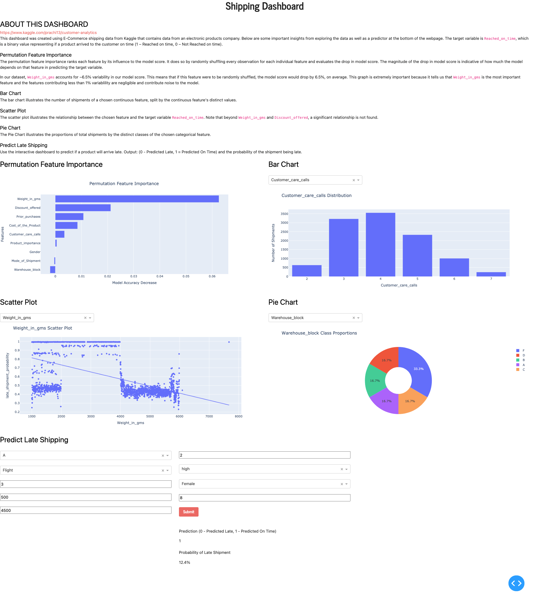

# What the app does
The app shows visualizations from E-Commerce shipping data from Kaggle
[here](https://www.kaggle.com/prachi13/customer-analytics). It's also
interactive in creating a scatter plot based on a user-chosen feature when
compared with the target variable `Reached_on_time`. 

### Feature Variables
The dataset contains 10,999 observations and 10 features. The 10 features are:

• `Warehouse_block` – The Company has a big Warehouse which is divided into blocks A, B, C, D, and E.

• `Mode_of_Shipment` – The Company ships the products in multiple ways such as Ship, Flight and Road.

• `Customer_care_calls` – The number of calls made from enquiry for enquiry of the shipment.

• `Customer_rating` – The company has rated from every customer. 1 is the lowest (Worst), 5 is the highest (Best).

• `Cost_of_the_Product` – Cost of the Product in US Dollars.

• `Prior_purchases` – The Number of Prior Purchases.

• `Product_importance` – The company has categorized the product in the various parameter such as low, medium, high.

• `Gender` – Customer's gender, either Male or Female.

• `Discount_offered` – Discount offered on that specific product.

• `Weight_in_gms` – It is the weight in grams.

### Target Variable
• `Reached_on_time` – It is the target variable, where 1 Indicates that the product has NOT reached on time and 0 indicates it has reached on time. Switched to 1 = Reached on time and 0 = Not reached on time.

### Tools
This dashboard was built using Dash by Plotly. The predictor uses a trained Gradient Boosting Classifier model from Sci-kit Learn's library. This application is being served on AWS via Heroku.

### Improvements
In order to improve this dashboard, I would first work on improving the model. Although I delivered the model after a round of tuning using Sci-kit Learn's GridSearch, the model is currently held back by noise from a few of the existing features in the dataset. Removing these features would improve the model. For the purpose of this project, I decided to leave most of the features in training the model for the sake of interactivity. 

I would also improve the UI/UX. I acknowledge this isn't the best looking dashboard but is an MVP that would be delivered to a stakeholder such as a supply chain/logistics manager. This is the product of a week's worth of work, so improvements can definitely be made, and more visualizations would be great for a more comprehensive analysis of the shipping data. Thanks for taking the time to explore!"""),
